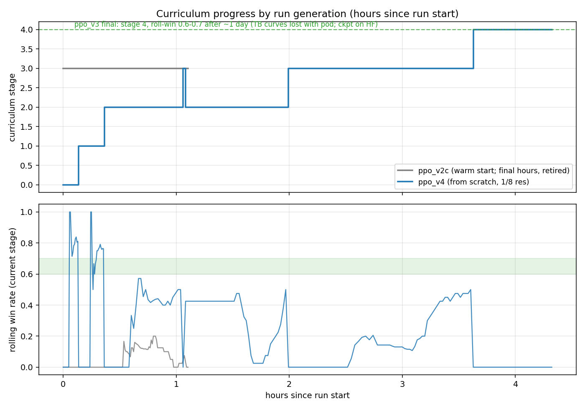
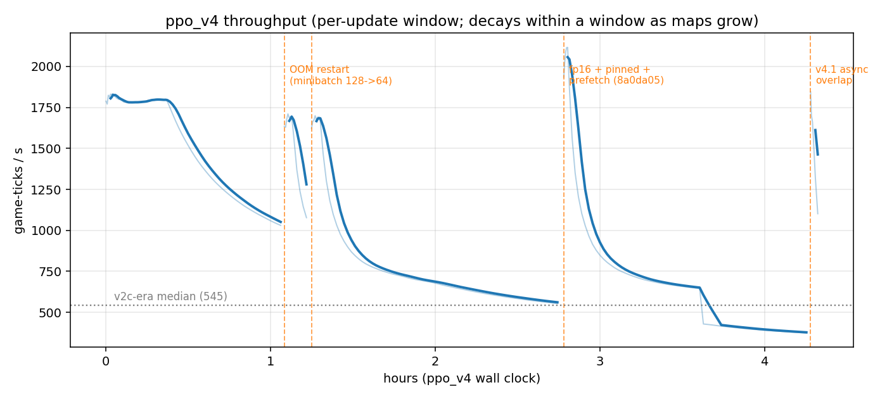
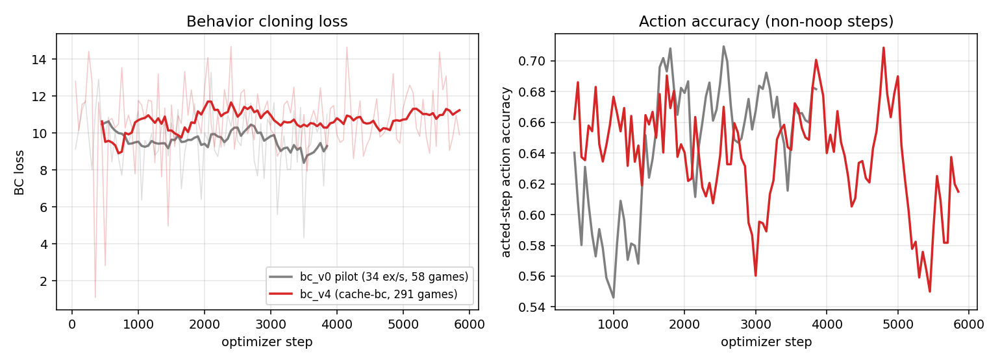

# openfront-ai

Toward a self-play RL agent for [OpenFront.io](https://openfront.io): headless
data generation on the real game engine, a learned spatial observation
encoder, and PPO self-play over the full action surface.

**Devlog:** [djmango.github.io/openfront-ai/devlog.html](https://djmango.github.io/openfront-ai/devlog.html) - run ledger, timeline, bugs,
lessons, and the full AE v3.1 bake-off. **Living spec:**
[DESIGN.md](DESIGN.md).

## Status (Jul 14)

- **375k bot + 420k human** full-state snapshots; human games replayed
  deterministically from the public archive.
- **Spatial AE v3.1** concluded: latent *resolution* (1/8, not channel count)
  fixes the human/bot border-accuracy gap. Policy encoder: **`ae_v31_d8c32`**
  (32ch @ 1/8, 88.2% human / 95.5% bot borders). AE train/prefeaturize via
  Rust **`ofae`** (Python `ae/` removed).
- **PPO via Rust `oftrain`** (Python `rl/` stack removed). ~6M-param policy,
  win-gated curriculum, safetensors checkpoints, native + Node engine hedge.
- Showcase / live play: `ofshowcase` + webbot ONNX (`scripts/export_onnx.py`,
  `scripts/play_live.sh`). Thin Python remains for ONNX/Playwright/libtorch.

## Architecture: compress the map, bypass the rest

The observation design went through three iterations (see `DESIGN.md`):

1. **v1** - tile-only autoencoder over ownership + terrain.
2. **v2** - one unified AE compressing *all* state (tiles, players, units,
   diplomacy) into a joint latent. Spatial recon was excellent but tiny exact
   facts fought the bottleneck: alliance pairs peaked at F1 0.67 and relative
   troop strength at 0.81, no matter how losses were weighted.
3. **v3 (current)** - **only compress what is actually big.** The AE
   compresses the map (tile ownership, terrain, fallout, static structures).
   Everything small and exact bypasses the latent: pairwise diplomacy bits,
   per-player scalars, transient units (nukes in flight with impact points,
   transports, warships), attack aggregates, legality masks.

**The lesson: a one-bit fact reconstructed at 95% is strictly worse than
reading the bit.** Autoencoders are for high-dimensional state; exact small
state should never fight the map for latent capacity.

### AE v3.1: border accuracy

Overall tile accuracy saturates near 99% (water inflates it); **border-tile
accuracy** is the honest metric. Benchmarking the bot-trained v3 on human
games exposed a 16-point domain gap (87.5% bot borders vs 71.8% human).
Mixed bot+human retraining helped; the architectural fix was **halving the
latent patch size** (1/8 resolution instead of 1/16):

| model | latent | border (human) | border (bot) |
|---|---|---|---|
| v3 bot-only | 64ch @ 1/16 | 71.8% | 87.5% |
| v3 on bot+human mix | 64ch @ 1/16 | 80.1% | 86.8% |
| v3.1 @ 1/8 res | 64ch @ 1/8 | **89.3%** | **96.1%** |
| **v3.1 d8c32 (policy)** | **32ch @ 1/8** | **88.2%** | **95.5%** |

Structure detection stayed at precision/recall 1.0 per class throughout.
The policy also gets a raw **64×64 local owner-crop** around ego territory for
exact borders where the agent acts; the latent carries global context.

Original v3 training curves and reconstructions (64ch @ 1/16):


## RL progress

Curriculum v2: 11 stages over 7 maps (Onion → Pangaea → Caucasus → …),
win-gated advancement (rolling win rate > 0.5 over last 40 on-stage episodes),
25% rehearsal against earlier maps at current difficulty, dense wins from 1v1
stage 0. Strength-index reward (land + military + economy), not raw territory.







Graphs from `scripts/make_progress_graphs.py`. Highlights:

- **Curriculum:** `ppo_v4` matched `ppo_v3`'s pace despite the heavier 1/8
  stack, learned spawns, and two mid-run restarts. Warm-started `ppo_v2c`
  stalled at stage 3 while from-scratch v3 reached stage 4.
- **Throughput:** fp16 transfers + pinned staging + prefetch took stage-3–4
  game-ticks/s from ~590 → ~2100; v4.1 async rollout/update overlap hides
  the rollout phase inside the update.
- **BC (historical):** prefeaturized cache cut sample cost from ~15–20 ms to
  ~1.5 ms; Python BC trainer since removed (moratorium / oftrain-only path).

Sample agent replay: [assets/replay_v2_stage3.webm](assets/replay_v2_stage3.webm)
(`ppo_v2c` on stage 3 - Onion, 80 Medium bots; peaks ~13k tiles before dying
at tick 3891).

## Key learnings

Condensed from the [devlog](https://djmango.github.io/openfront-ai/devlog.html#lessons):

- **Make wins reachable before making them valuable.** 1v1 → 1v3 staging turned
  the win bonus from theoretical to dense; win detection was silently broken
  until Jul 6 (checked username, engine emits clientID).
- **Warm starts inherit stale habits.** `ppo_v2c` resumed v2b weights under
  the new curriculum; from-scratch `ppo_v3` overtook it in one day. Retrain
  when reward or curriculum changes materially.
- **Benchmark on the distribution you'll deploy on.** Bot data underrepresents
  human gnarl (naval invasions, enclaves, diplomacy).
- **Spatial precision can't be bought with channels.** Halving the latent patch
  beat +50% channels; don't make the latent re-encode static side-information
  (terrain) the policy already has.
- **Log the metric you care about.** Border accuracy cost one line; overall
  tile accuracy looked done at 87% while human borders were 16 points worse.
- **Pad to the batch, not the maximum.** Most of a "GPU too slow" problem was
  wasted convolution on small-map batches.
- **Watch the agent play.** Replay tooling caught the win-detection bug; curves
  never would have.

## Layout

- `datagen/` - TypeScript headless game runner. Boots the real
  (deterministic) OpenFront engine in Node, plays bot/nation games, dumps
  full-state snapshots every 10 ticks.
- `rust/` - `oftrain` (PPO), `ofae` (spatial AE train/prefeaturize), `ofhub`
  (HF sync + showcase), `ofcore` (feat/curriculum), `engine` (native sim).
- `webbot_export/` - slim Policy + AE encoder + safetensors→ONNX helpers for
  browser play (thin Python island; Torch also provides libtorch for `tch`).
- `bridge/` - persistent Node process wrapping the engine (JSONL reset/step
  over stdio, binary tile IPC).
- `scripts/` - ONNX export, client replay render, HF upload, `pod_train_v10.sh`
  (RunPod launcher; `pod_train_v8.sh` is a compatibility shim), `fetch_ae_encoders.sh`.
- `docs/` - devlog and training graphs.
- `openfront/` - git submodule of
  [openfrontio/OpenFrontIO](https://github.com/openfrontio/OpenFrontIO),
  pinned to a known-good engine commit.

## Setup

```bash
git submodule update --init
(cd openfront && npm install)
uv sync
```

## Generate data

```bash
# single map
openfront/node_modules/.bin/tsx datagen/generate.ts --map Onion --games 20

# the 10-map bot dataset (25 games each, 10 in parallel)
bash datagen/gen_all.sh 25 10

# human archive → deterministic replay → snapshots
bash datagen/replay_all.sh
```

Snapshots are written every 10 ticks (1s of game time). Format details in the
[dataset card](https://huggingface.co/datasets/djmango/openfront-snapshots).

## Train

```bash
# one-time: convert gzip+JSON snapshots to fast zstd caches
cd rust && cargo run --release -p ofae -- prefeaturize --data ../data --workers 8

# spatial AE (v3.1) - writes ae_v3.safetensors + ae_v3.encoder.safetensors
cargo run --release -p ofae -- train \
    --data ../data,../data-human \
    --steps 40000 --batch-size 64 --latent-down 8 --latent-c 32 \
    --out ../runs/ae_v31_d8c32

# optional: filter a full ckpt → encoder-only (train already writes encoder)
cargo run --release -p ofae -- export-encoder \
    --ckpt ../runs/ae_v31_d8c32/ae_v3.safetensors \
    --out ../weights/ae/ae_v31_d8c32.encoder.safetensors

# or pull frozen encoders from HF
bash ../scripts/fetch_ae_encoders.sh

# PPO (oftrain) - see scripts/pod_train_v10.sh for the RunPod launcher
cargo build --release -p oftrain --features native-engine
# then: ./target/release/oftrain --help  /  bash ../scripts/pod_train_v10.sh
```

AE details: owner IDs relabeled to static per-game spawn slots (any player
count, fixed channels); fully convolutional training on border-dense random
crops; rarity-weighted BCE *detection* for structures (count MSE collapses to
all-zeros on 99.9%-empty grids).

## Artifacts

- Bot snapshots: [djmango/openfront-snapshots](https://huggingface.co/datasets/djmango/openfront-snapshots)
  (~375k frames, 250 games, 10 maps)
- Human games: [djmango/openfront-human-games](https://huggingface.co/datasets/djmango/openfront-human-games)
  (285 hash-verified replays + raw intent records)
- RL GameRecords: [djmango/openfront-replays](https://huggingface.co/datasets/djmango/openfront-replays)
  (sparse-turn parquet shards from training/watch; `ofhf replays` / `ofhf replays-pull`)
- Encoders: [djmango/openfront-tile-autoencoder](https://huggingface.co/djmango/openfront-tile-autoencoder)
  (`ae_v31_d8c32.pt`, `ae_v31_d8.pt`, `ae_v3.pt`)
- Current Rust RL runs on HF use `latest.safetensors`,
  `latest.state.json`, best-eval/milestone safetensors, and `manifest.json`
  under the run name.

## RL stack (Rust oftrain)

- **`bridge/env.ts`** - persistent Node process: JSONL reset/step, binary tile
  IPC, exact legality masks from engine calls each decision step (TS engine
  path / `--node-fraction` hedge).
- **`rust/ofcore`** - obs featurization + curriculum (port of the old Python
  obs/curriculum). Frozen AE latent + ego planes + local crop + bypass.
- **`rust/oftrain`** - PPO + GAE, entropy anneal, stage LR warmdown, win-gate,
  safetensors checkpoints, native or Node engine.
- **`rust/ofhub`** - HF sync (`ofhf`), showcase hub/archive (`ofshowcase`),
  encoder filter (`ofexport`).

### Watching the agent play

`oftrain --watch` runs a greedy episode and saves an engine `GameRecord` -
the same format openfront.io archives - which the **real game client**
replays with the full UI. Showcase automation: `ofshowcase daemon`.

```bash
# after building oftrain (see rust/README.md)
./rust/target/release/oftrain --watch --help
```

**Client video** - `scripts/render_client_replay.py` replays the record in the
actual OpenFront client (headless Chromium):

```bash
uv run playwright install chromium   # one-time
uv run python scripts/render_client_replay.py \
    --record records-rl/game.json --out replays/game_client.webm
```

### Playing against the agent

In-browser webbot (ONNX) via showcase hub `/play` or locally:

```bash
bash scripts/play_live.sh --game '<lobby URL or 8-char ID>'
```

Export ONNX from an oftrain checkpoint:

```bash
PYTHONPATH=. uv run python scripts/export_onnx.py \
    --ae runs/ae_v31_d8c32/ae_v3.pt \
    --policy rust/checkpoints/ppo_v10/latest.safetensors \
    --out openfront/resources/webbot/models
```

## Roadmap

1. ~~Headless datagen + spatial autoencoder~~ (done)
2. ~~Environment bridge + obs builder + PPO scaffold~~ (done)
3. ~~AE v3.1 border-accuracy push + policy stack~~ (done)
4. ~~Rust oftrain PPO + native engine~~ (done; Python RL removed)
5. Scale PPO: reward shaping audit, recurrence, self-play league
6. ~~Port AE training to Rust (`ofae`)~~ (done; Python `ae/` removed)
