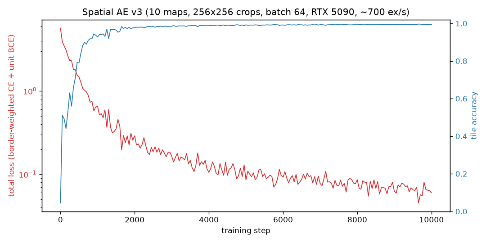
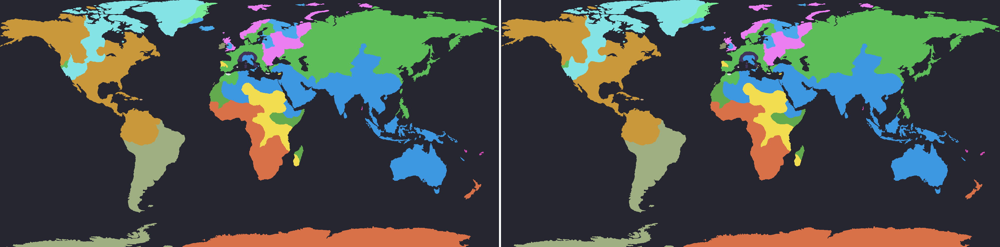

# openfront-ai

Toward a self-play RL agent for [OpenFront.io](https://openfront.io): headless
data generation on the real game engine, a learned spatial observation
encoder, and (next) a PPO self-play agent over the full action surface.

## Architecture: compress the map, bypass the rest

The observation design went through three iterations (see `DESIGN.md`):

1. **v1** — tile-only autoencoder over ownership + terrain.
2. **v2** — one unified AE compressing *all* state (tiles, players, units,
   diplomacy) into a joint latent. This worked for spatial state but spent
   most of its capacity and all of our tuning effort reconstructing tiny
   exact facts: alliance pairs peaked at F1 0.67 and relative troop
   strength at 0.81, no matter how the losses were weighted.
3. **v3 (current)** — the lesson: **only compress what is actually big.**
   The AE compresses the map (tile ownership, terrain, fallout, static
   structures — the only high-dimensional state). Everything small and
   exact bypasses the latent and feeds the policy raw: pairwise diplomacy
   bits, per-player scalars, transient units (nukes in flight with their
   impact points, transports, warships), attack aggregates, legality masks.

## Results (spatial AE v3)

1.17M params, 64-channel latent per 16x16 region (64x spatial compression),
any map size. Trained 10k steps / batch 64 in ~15 min on an RTX 5090 at
~700 crops/s:



Original (left) vs reconstruction through the latent (right), World map:



- Tile accuracy 99.4% overall; border-tile accuracy (the honest metric —
  water inflates the overall number) 98.8% on Onion, 87.4% on World, 82.1%
  on Africa mid-game with dozens of players.
- Static structures (city, port, defense post, missile silo, SAM launcher,
  factory): **precision 1.0 and recall 1.0, every class**, through the
  latent — rarity-weighted BCE detection, not count regression (count MSE
  collapses to all-zeros on 99.9%-empty grids).
- First 3 latent PCA components, World:


## Layout

- `datagen/` — TypeScript headless game runner. Boots the real
  (deterministic) OpenFront engine in Node, plays bot/nation games, dumps
  full-state snapshots every 10 ticks: packed tile grid + all entities
  (players, diplomacy, units with target tiles, attacks).
- `ae/` — PyTorch: dataset loaders, spatial AE (`model_v3.py`), training
  (`train_v3.py`). `model.py`/`model_v2.py` are the earlier iterations.
- `scripts/` — prefeaturization, evals, visuals, HF upload.
- `openfront/` — git submodule of
  [openfrontio/OpenFrontIO](https://github.com/openfrontio/OpenFrontIO),
  pinned to a known-good engine commit.

## Setup

```bash
git submodule update --init
(cd openfront && npm install)
uv sync
```

## Generate data

```bash
# single map
openfront/node_modules/.bin/tsx datagen/generate.ts --map Onion --games 20

# the 10-map dataset (25 games each, 10 in parallel)
bash datagen/gen_all.sh 25 10
```

Snapshots are written every 10 ticks (1s of game time), so a typical nuke
flight (20-60 ticks) spans 2-6 snapshots. Format details in the
[dataset card](https://huggingface.co/datasets/djmango/openfront-snapshots).

## Train

```bash
# one-time: convert gzip+JSON snapshots to fast zstd caches (~10ms -> ~0.5ms/sample)
PYTHONPATH=. uv run python scripts/prefeaturize.py --data data --workers 8

uv run python -m ae.train_v3 --data data --steps 10000 --batch-size 64
```

Details:

- Owner IDs are relabeled to static per-game slots (assigned once by spawn
  order) and embedded via a learned 8-dim lookup, so any player count works
  with fixed input channels.
- Fully convolutional: trains on random 256x256 crops, runs on any map size.
- Losses: border-weighted cross-entropy over owner slots (borders are what
  matter strategically and blur first) + rarity-weighted BCE over static
  structure occupancy at latent resolution.
- Data pipeline: `DataLoader` worker processes over memory-mapped zstd-1
  frame caches; the GPU, not the loader, is the bottleneck.

## Artifacts

- Dataset: [djmango/openfront-snapshots](https://huggingface.co/datasets/djmango/openfront-snapshots)
  (~375k full-state snapshots, 250 games, 10 maps)
- Checkpoints: [djmango/openfront-tile-autoencoder](https://huggingface.co/djmango/openfront-tile-autoencoder)

## RL (in progress)

- `bridge/env.ts` — persistent Node process wrapping the engine: JSONL
  reset/step over stdio, ships the packed tile grid (gzip+base64), full
  entities, and exact legality masks from engine calls each decision step.
- `rl/env.py` — Python subprocess wrapper.
- `rl/obs.py` — observation builder: frozen AE latent + ego ownership
  planes + exact transient-unit planes (nukes with impact points, SAM
  locks) + per-player bypass features + legality masks.
- `rl/policy.py` — conv trunk, factorized masked heads: action type,
  player-target pointer, tile-region pointer, build/nuke type, quantity.
- `rl/ppo.py` — PPO + GAE, TensorBoard logging (`runs/rl/<name>`):

```bash
uv run python -m rl.ppo --map Onion --updates 1000 --name ppo_v1
uv run tensorboard --logdir runs/rl   # live dashboard
```

### Watching the agent play

`rl/watch.py` runs one greedy episode, renders a native-resolution WebM, and
saves an engine `GameRecord` — the same format openfront.io archives — which
the **real game client** can replay with the full UI. The video includes a
debug side panel (chosen action + arguments, action-probability bars, value
estimate, recent-action log) and on-map markers for tile/player targets;
pass `--no-debug` for a clean map-only render:

```bash
uv run python -m rl.watch --policy /tmp/policy.pt --stage 3 \
    --out replay.webm --record records-rl/game.json
openfront/node_modules/.bin/tsx scripts/verify_record.ts records-rl/game.json
```

**Real-graphics video** — `scripts/render_client_replay.py` replays the
record in the actual OpenFront client (headless Chromium) and records a
webm: full game UI, terrain art, units, boats, nukes, leaderboard. Client
hooks (localStorage, patch in `patches/client-replay-tooling.patch`) give
it the agent's identity — **AGENT** on the leaderboard/territory, gold
spawn ring, crown when first, the "You Won!" modal — and start the camera
centered on the whole map. If the record has a `.debug.json` sidecar
(written automatically by `rl.watch --record`), the video also gets a live
MODEL panel: chosen action, value estimate, action-probability bars, and a
recent-actions log, synced to the sim tick:

```bash
uv run playwright install chromium   # one-time
uv run python scripts/render_client_replay.py \
    --record records-rl/game.json --out replays/game_client.webm
# flags: --speed {0.5,1,2,max}, --no-overlay, --headed to watch it live
```

To browse a replay interactively instead, follow the manual steps in the
`scripts/serve_replay.py` docstring (same shim + client, real browser).
The MODEL panel appears there too — it's rendered by the client itself
(`RlDebugOverlay` hook) whenever `apiHost` points at the shim and the
record has a sidecar.

The bridge mirrors the client's `createGameRunner()` init exactly (same
PseudoRandom ID stream, no spawn timer in singleplayer), so records replay
bit-identically: `verify_record.ts` re-simulates from intents alone and
reproduces the agent's tile counts and death tick.

Sample: [assets/replay_v2_stage3.webm](assets/replay_v2_stage3.webm)
(ppo_v2c on stage 3 — Onion, 80 Medium bots; peaks ~13k tiles before dying
at tick 3891).

### Playing against the agent

`bridge/play.ts` speaks the real client websocket protocol: it joins a live
lobby, mirrors the deterministic sim from server turns, and submits intents
picked by the policy. You fight it from the normal browser client:

```bash
(cd openfront && npm run dev)      # client :9000 + game server
# browser: Create Lobby (private), copy the lobby ID, then:
uv run python -m rl.play --policy /tmp/policy.pt --game <LOBBY_ID>
# "AgentRL" appears in the lobby; Start Game and fight it.
```

While you fight it, the MODEL panel (action, value, probability bars,
recent log) tracks the agent in real time — `rl.play` serves its decisions
on `--debug-port` (default 8988) and the client probes that port
automatically on localhost. No setup; disable with
`localStorage.setItem("rlDebugOverlay", "0")`, or set `rlDebugHost` if you
picked a non-default port.

## Roadmap

1. ~~Headless datagen + spatial autoencoder~~ (done, above)
2. ~~Environment bridge + obs builder + PPO scaffold~~ (done, above)
3. Scale PPO: parallel envs (the env loop, not the net, is the bottleneck),
   remaining action heads (upgrade/delete/move-warship/cancel-boat),
   reward shaping beyond territory delta
4. Self-play league
