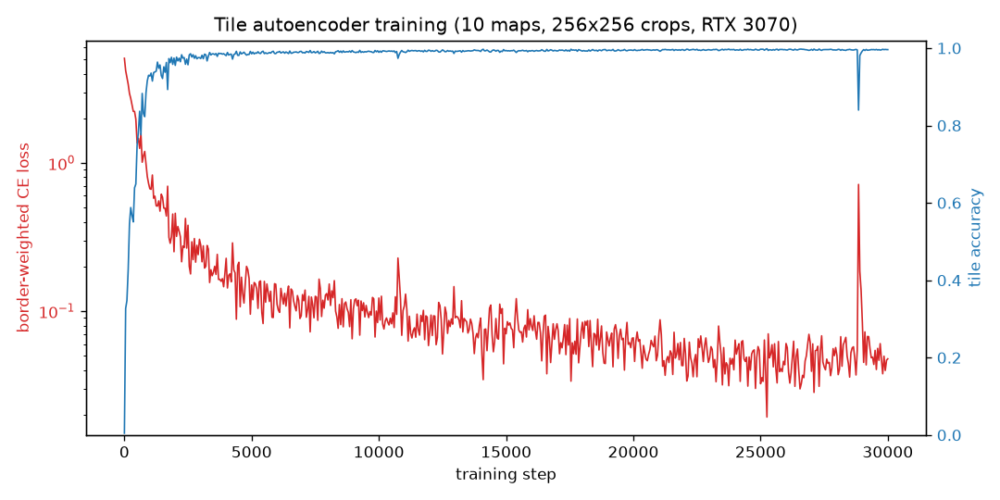
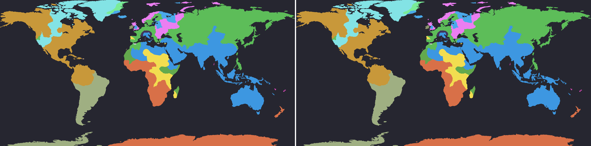

# openfront-ai

Learned spatial observation encoding for [OpenFront.io](https://openfront.io) RL agents.

This is step one of a larger project to train a self-play RL agent for OpenFront:
a fully-convolutional autoencoder that compresses raw tile-ownership state (64x
compression) into a spatial latent grid intended as the observation input for a
future policy network.

## Layout

- `datagen/` — TypeScript headless game runner. Boots the real (deterministic)
  OpenFront engine in Node with no browser or server, plays bot/nation-only
  games, and dumps gzipped tile-state snapshots plus per-player stats.
- `ae/` — PyTorch autoencoder: dataset loader, model, training loop.
- `openfront/` — clone of [openfrontio/OpenFrontIO](https://github.com/openfrontio/OpenFrontIO)
  (gitignored; clone it yourself, see setup).

## Setup

```bash
git clone https://github.com/openfrontio/OpenFrontIO.git openfront
(cd openfront && npm install)
uv sync
```

## Generate data

```bash
# single map
openfront/node_modules/.bin/tsx datagen/generate.ts --map Onion --games 20

# the 10-map dataset (25 games each, 10 in parallel)
bash datagen/gen_all.sh 25 10
```

Each game writes `data/<map>/<gameID>/` containing `terrain.bin` (immutable
terrain bytes), `states/t<tick>.bin.gz` (packed uint16 tile state every 25
ticks: owner id in bits 0-11, fallout bit 13, defense bonus bit 14), and
`meta.json` (dims, per-snapshot player stats, winner).

Throughput: a full game to victory takes ~5 s on a small map (~2,500 ticks/s
headless), ~60 s on the largest maps.

## Train

```bash
uv run python -m ae.train --data data --steps 30000 --batch-size 16
```

Details:

- Owner IDs are relabeled to static per-game slots (assigned once by spawn
  order, never reshuffled) and embedded via a learned 8-dim lookup, so any
  player count works with fixed input channels.
- Fully convolutional: trains on random 256x256 crops, runs on any map size.
  The latent is a spatial grid, 64 channels per 16x16 tile region.
- Loss is border-weighted cross-entropy over owner slots — territory borders
  are what matter strategically and are what reconstruction losses blur first.

## Results (v1)

Trained 30k steps (batch 16) on 250 games / 10 maps, ~40 min on an RTX 3070 at
~200 crops/s. Model: 1.0M params, latent 64 channels per 16x16 region.



Overall tile accuracy saturates >99% within ~3k steps; the remaining training
mostly sharpens borders (the border-weighted CE keeps falling on a log scale).
30k steps was overkill — ~10k gets within a hair of the same quality.

Original (left) vs reconstruction through the 64-channel latent (right), on a
World-map game with 17 surviving players:



Honest numbers (mid/late-game snapshots): overall accuracy is inflated by
water and empty land, so the metric that matters is **border-tile accuracy** —
98.7% on a late-game 2-player map, 91.4% on World with 17 players, 90.1% on
Africa with 27 players. Small enclaves and 1-tile border noise are what get
lost; large-scale territory geometry survives.

Compression per 16x16 region: 256 tiles -> 64 floats. Relative to the
embedded input a policy would otherwise consume (11 channels at full
resolution) that is a 44x smaller observation; a 2000x1000 World state becomes
a 125x62x64 latent grid. The first 3 PCA components of that grid (World):


Artifacts: dataset at
[djmango/openfront-snapshots](https://huggingface.co/datasets/djmango/openfront-snapshots),
checkpoint at
[djmango/openfront-tile-autoencoder](https://huggingface.co/djmango/openfront-tile-autoencoder).

## Roadmap

1. ~~Headless datagen + autoencoder~~ (this repo)
2. Latent-quality probes (predict tile counts and future territory delta from
   the frozen latent)
3. Gym-style environment bridge (reset/step over the headless engine)
4. PPO agent on the frozen encoder, then self-play league
