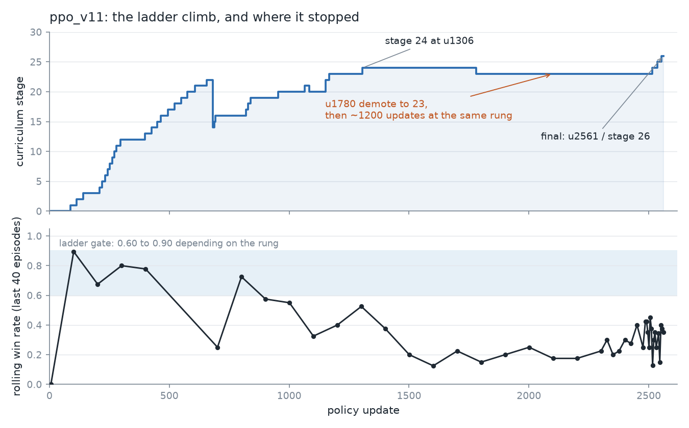
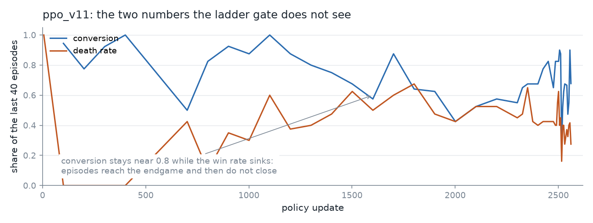
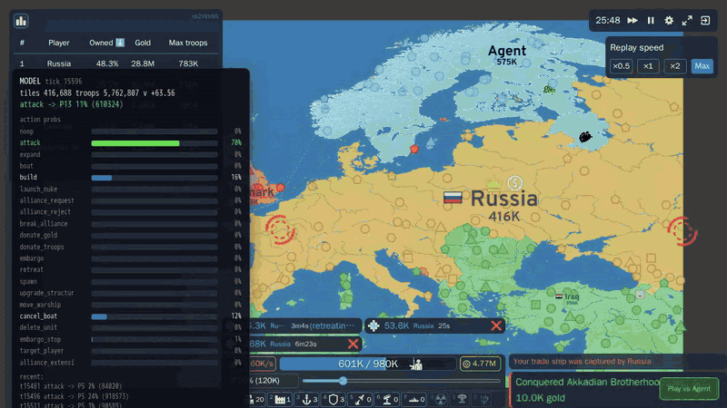
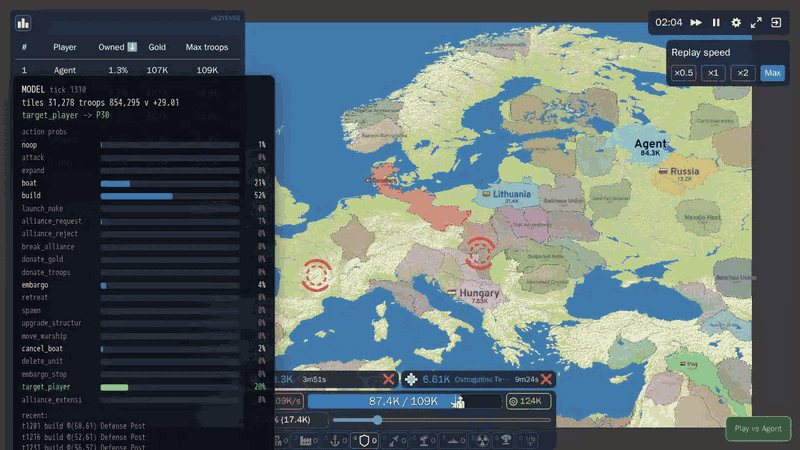
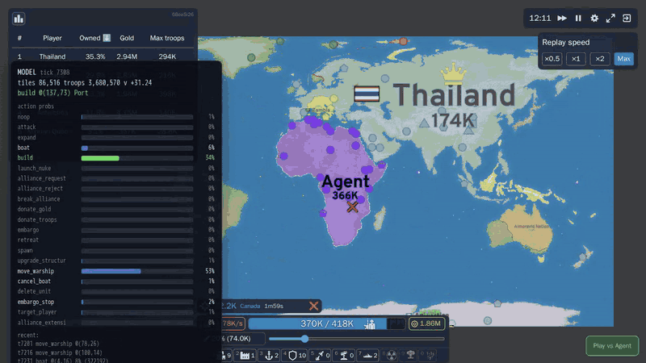
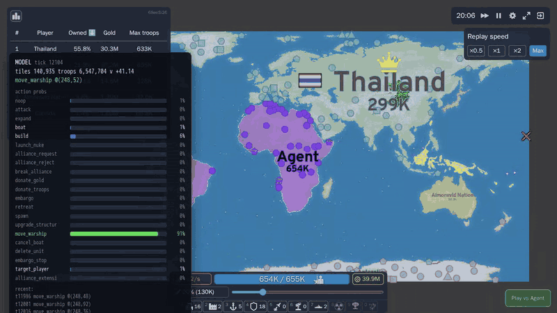
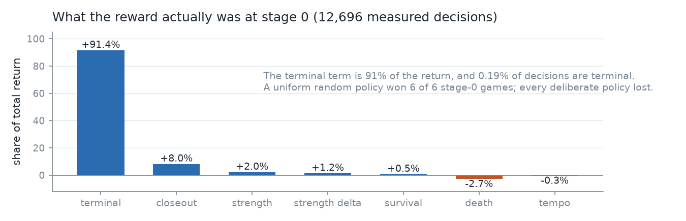
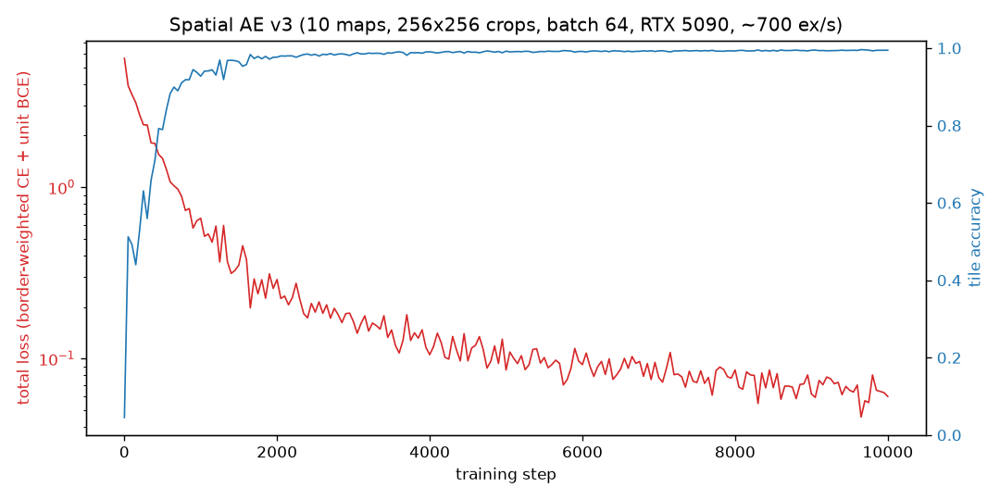
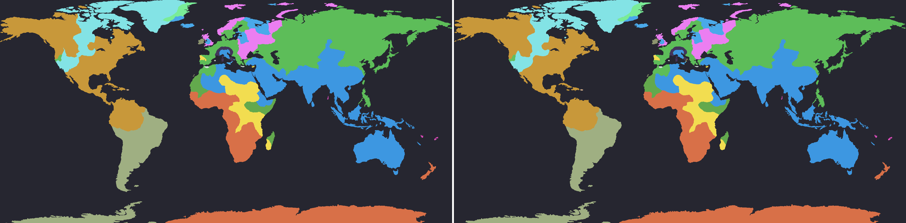

# openfront-ai

A self-play reinforcement learning agent for [OpenFront.io](https://openfront.io). It
covers headless data generation on the real game engine and a learned spatial
observation encoder. PPO trains over the full action surface of the game.

The project is finished. This README describes the last and strongest run
(`ppo_v11`), what it reached, and what the whole attempt taught us.

**Devlog:** [djmango.github.io/openfront-ai/devlog.html](https://djmango.github.io/openfront-ai/devlog.html) - run ledger, timeline, bugs,
lessons, and the full AE v3.1 bake-off. **Living spec:** [DESIGN.md](DESIGN.md).
**Play against a checkpoint in the browser:** [openfrontai.skg.gg](https://openfrontai.skg.gg).

## The final run: `ppo_v11`

| | |
|---|---|
| Policy | 38.6M parameters, 133 tensors, safetensors |
| Observation | 99 grid channels (100 on the fine grid), 28 player features, 57 transient planes, 11 scalars, 5 local planes, 32 unit slots |
| Action surface | 21 action types, 7 build types, 5 nuke types, a continuous quantity head |
| Recurrence | LSTM, hidden 512, state 1024, BPTT 24, rollout 48, `action-outcome-v1` context |
| Encoders | frozen `ae_v32_nostatic` at 1/8 (fine, 32ch) and 1/16 (coarse, 32ch) |
| Reward / curriculum | `v10-anti-spiral-v1` over the 100-stage `v10` ladder |
| Final checkpoint | update 2561, stage 26, 16.8M environment steps |
| Weights | [djmango/openfront-rl](https://huggingface.co/djmango/openfront-rl), `ppo_v11/latest.safetensors` |

Every number above is read from the published `manifest.json` and
`latest.state.json`, not from a plan document.

### What it reached

The curriculum starts on Onion against bots only and ends on 16 maps at
Impossible. `ppo_v11` entered the ladder at stage 0 and left it at stage 26.

- Stages 0 to 14 are bots-only Easy lobbies with a 95% win gate. The run cleared
  them at a high rate and reached stage 24 by update 1306.
- From update 1780 the run sat on one rung, stage 23, for about 1200 updates.
  The rolling win rate there ran between 0.15 and 0.45 against a gate near 0.8.
- Two late advances took it to 26 (updates 2536 and 2553) before training ended.

The honest summary is that the agent clears the easy tiers comfortably and
stops where several nations share the map.



Conversion, the share of episodes that reach the endgame, stays near 0.8 while
the win rate sinks. The agent reaches the endgame in most episodes, then loses
the game at the end.



Both figures come from `docs/v11_milestones.csv`, extracted from the published
checkpoints, and are drawn by `scripts/make_v11_graphs.py`.

## The agent playing, in the real client

These clips are the OpenFront client replaying recorded `ppo_v11` episodes. The
agent is the nation named `Agent`. The panel on the left is its own policy head,
so you can read the action probabilities while it plays. Each clip is a cut from
a full client render, so the footage is the real game.

Europe. The agent launches an atom bomb at tick 16306. The client shows the
inbound warning, the blast lands in southern Russia, and Russia's troop count
falls from 419K to 114K:



Europe, early. At tick 1710 the agent holds 31,278 tiles. It builds a City and
sends two boats, one with 128K troops and one with 396K:



World. At tick 7708 the agent holds Africa with 86,516 tiles and fills the
border with Defense Posts:



World, late. At tick 12903 the agent holds 140,935 tiles, keeps five warships
and two missile bases, and loads a boat with 1.9M troops:



Full clips of the real client:

- [Europe, 110 s](https://share.skg.gg/u/4iMMic.webm)
- [World, 85 s](https://share.skg.gg/u/0xCL4E.webm)
- [Europe, harder probe, 53 s](https://share.skg.gg/u/66idcY.webm)

Reproduce one with `scripts/render_client_replay.py`, which boots the engine in
Node, opens headless Chromium, and films the client.

## Results across the project

| Run | Setting | Best measured result |
|---|---|---|
| `ppo_v10` | 100-stage Easy ladder, 4×A40 | 0 to 27 stages in about 12 hours. Conversion 0.98, timeout-after-closeout about 0. Ended at update 12581 / stage 25. |
| `ppo_v11` | the ladder plus the V11 observation and LSTM, 4×A100 then 1×H100 | stage 26 at update 2561. Bots-only Easy tiers cleared at a high rate, then stalls where nations appear. |
| `ppo_duo` (run G) | two-human team mode, one RTX 3070 | 101 wins in 245 episodes (WR 0.41). Caucasus 44/46 (0.96), Onion 38/51, Pangaea 7/9, water maps 12/139. |
| CUDA environment port | PufferLib 5.0 on one RTX 5080 | 727,110 environment ticks per second at 1024 envs. Parity with the Rust engine is a ladder, not a switch. |

Team mode ran on a teammate-aware observation stack and never solved water maps.
The win rule there is 95% combined land, and the agent was unable to hold
a continent and cross an ocean in the same episode.

## What we tried and what we learned

- **Make wins reachable before making them valuable.** Staging 1v1 then 1v3
  turned the win bonus from a theoretical number into a dense signal. Win
  detection itself was silently broken for days, because the engine reports a
  clientID and the checker read a username.
- **A one-bit fact rebuilt at 95% is worse than reading the bit.** The first
  autoencoder compressed all state, and tiny exact facts fought the map for
  latent capacity. Compress the map. Pass diplomacy, scalars and unit identity
  through untouched.
- **Spatial precision is not bought with channels.** Halving the latent patch
  size beat adding 50% more channels: human border accuracy went from 71.8% to
  88.2%, while overall tile accuracy had looked finished at 87%.
- **Log the metric you care about, and watch the agent play.** Border accuracy
  and replay tooling each found a bug that no reward curve would have shown.
- **The reward and the curriculum stopped paying before the encoder did.**
  `ppo_v10` and `ppo_v11` climbed the same ladder with different encoders and
  different memory. The bottleneck at stage 23 was not another reward term.
- **Test the reward stream as a stream.** A measured audit of the stage-0
  reward in the PufferLib port found 91% of the return in the terminal term,
  which fires on 0.19% of decisions. A uniform random policy won 6 of 6 stage-0
  games while every deliberate policy lost. See
  [docs/stage0-reward-audit.md](docs/stage0-reward-audit.md).



- **Warm starts inherit stale habits.** A run resumed onto a new curriculum
  lost to a from-scratch run inside a day. Retrain when the reward or the
  curriculum changes in a material way.
- **A GPU environment needs a parity ladder.** Exact where exactness is cheap,
  statistical where it is not. The port has seven levels, and a level that has
  not passed makes every number above it a throughput claim, never a result.
- **Long training runs do not belong in a terminal.** Jobs launched from an
  agent shell died with their parent. Systemd units, a stall watchdog and a
  timer that restarts a dead run are what kept overnight training alive.
- **A config key that nothing reads looks like a working one.** The trainer
  ignored `load_model_path` for weeks. The flag was read back correctly from the
  unit and the log the whole time.

## Architecture: compress the map, bypass the rest

The observation design went through three iterations, all documented in
`DESIGN.md`:

1. **v1** - tile-only autoencoder over ownership and terrain.
2. **v2** - one unified autoencoder over all state (tiles, players, units,
   diplomacy). Spatial reconstruction was good; small exact facts were not.
   Alliance pairs peaked at F1 0.67 and relative troop strength at 0.81,
   whatever the loss weighting.
3. **v3 (final)** - compress only what is big. The autoencoder carries tile
   ownership, terrain, fallout and static structures. Everything small and exact
   bypasses the latent: diplomacy bits, per-player scalars, transient units
   (nukes in flight with impact points, transports, warships), attack
   aggregates, legality masks.

### AE v3.1: border accuracy

Overall tile accuracy saturates near 99% because water inflates it. Border-tile
accuracy is the honest metric. Benchmarking the bot-trained v3 on human games
showed a 16-point domain gap. The fix was to halve the latent patch size:

| model | latent | border (human) | border (bot) |
|---|---|---|---|
| v3 bot-only | 64ch @ 1/16 | 71.8% | 87.5% |
| v3 on a bot+human mix | 64ch @ 1/16 | 80.1% | 86.8% |
| v3.1 @ 1/8 res | 64ch @ 1/8 | **89.3%** | **96.1%** |
| **v3.1 d8c32 (policy)** | **32ch @ 1/8** | **88.2%** | **95.5%** |

Structure detection stayed at precision and recall 1.0 per class throughout.
The policy also reads a raw 64x64 owner crop around its own territory for exact
borders where it acts. The latent carries the global context.

Original v3 training curves and reconstructions (64ch @ 1/16):






## Layout

- `datagen/` - TypeScript headless game runner. Boots the real deterministic
  OpenFront engine in Node, plays bot and nation games, and writes full-state
  snapshots every 10 ticks.
- `rust/` - `oftrain` (PPO), `ofae` (spatial autoencoder), `ofhub` (HF sync and
  showcase), `ofcore` (features and curriculum), `engine` (native simulation).
- `webbot_export/` - slim policy, encoder and safetensors to ONNX helpers for
  browser play.
- `bridge/` - persistent Node process that wraps the engine over stdio.
- `scripts/` - checkpoint sync, ONNX export, client replay rendering, progress
  graphs, and the RunPod launchers.
- `docs/` - devlog, training graphs, and the reward audit.
- `openfront/` - git submodule of
  [openfrontio/OpenFrontIO](https://github.com/openfrontio/OpenFrontIO), pinned
  to a known-good engine commit.

## Setup

```bash
git submodule update --init
(cd openfront && npm install)
uv sync
```

## Generate data

```bash
# one map
openfront/node_modules/.bin/tsx datagen/generate.ts --map Onion --games 20

# the 10-map bot dataset, 25 games each, 10 in parallel
bash datagen/gen_all.sh 25 10

# human archive to deterministic replay to snapshots
bash datagen/replay_all.sh
```

Snapshots are written every 10 ticks, which is one second of game time. The
format is described in the
[dataset card](https://huggingface.co/datasets/djmango/openfront-snapshots).

## Train

```bash
# one-time: turn gzip+JSON snapshots into fast zstd caches
cd rust && cargo run --release -p ofae -- prefeaturize --data ../data --workers 8

# spatial autoencoder, v3.2 no-static
cargo run --release -p ofae -- train \
    --data ../data,../data-human \
    --steps 40000 --batch-size 64 --latent-down 8 --latent-c 32 \
    --out ../runs/ae_v32_nostatic_d8c32

# optional: pull frozen encoders from HF
bash ../scripts/fetch_ae_encoders.sh

# PPO; see scripts/pod_train_v10.sh for the RunPod launcher
cargo build --release -p oftrain --features native-engine
./target/release/oftrain --help
```

Autoencoder details: owner IDs are relabeled to static per-game spawn slots, so
any player count fits a fixed channel count. Training is fully convolutional on
border-dense random crops. v3.2 drops structures from the latent, because they
pass to the policy grid as 6 exact planes (`C_GRID=95`). Swapping the encoder
breaks a policy, so retrain PPO after a swap.

## Watch the agent play

`oftrain --watch` runs a stochastic episode, the same sampling that PPO rollouts
and win-rate windows use, and it saves an engine `GameRecord`. That is the same
format openfront.io archives, so the real client replays it with the full UI.
Greedy argmax is debug-only: it freezes near spawn and shows behaviour that
training never measured. Showcase automation runs as `ofshowcase daemon`.

```bash
uv run playwright install chromium   # one time
uv run python scripts/render_client_replay.py \
    --record records-rl/game.json --out replays/game_client.webm
```

Prefer a real NVIDIA GPU for the render (full Chromium, Xvfb, Vulkan). For a
human-facing batch, use several maps. Onion-only showcase runs mislead.

## Play against the agent

The showcase hub serves an in-browser webbot over ONNX at `/play`. Locally:

```bash
bash scripts/play_live.sh --game '<lobby URL or 8-char ID>'
```

Export ONNX from an oftrain checkpoint:

```bash
PYTHONPATH=. uv run python scripts/export_onnx.py \
    --ae runs/ae_v32_nostatic_d8c32/ae_v3.safetensors \
    --policy rust/checkpoints/ppo_v11/latest.safetensors \
    --out openfront/resources/webbot/models
```

## Artifacts

- Bot snapshots: [djmango/openfront-snapshots](https://huggingface.co/datasets/djmango/openfront-snapshots)
  (about 375k frames, 250 games, 10 maps)
- Human games: [djmango/openfront-human-games](https://huggingface.co/datasets/djmango/openfront-human-games)
  (285 hash-verified replays plus raw intent records)
- RL GameRecords: [djmango/openfront-replays](https://huggingface.co/datasets/djmango/openfront-replays)
  (sparse-turn parquet shards from training and watch runs)
- Encoders: [djmango/openfront-tile-autoencoder](https://huggingface.co/djmango/openfront-tile-autoencoder)
  (`ae_v32_nostatic_*`, legacy `ae_v31_*`)
- Policies: [djmango/openfront-rl](https://huggingface.co/djmango/openfront-rl), with
  `ppo_v11/latest.safetensors` as the production pointer and prior runs
  (`ppo_v10`, `ppo_v9`, `ppo_v86` to `ppo_v81`, `ppo_duo`) kept as latest plus
  manifest. See the [model card](docs/hf/openfront-rl/README.md).

## Where this stopped

- Stage 26 of 100. The ladder is the measurement, and the run did not reach the
  harder maps at Medium or above.
- Team mode holds a continent and loses the ocean. Water maps are 12 wins in
  139 episodes.
- The GPU environment port reaches high throughput. Closing the last parity
  levels is what would let a policy train on it, and that work is on the
  `puffer-env` branch.
